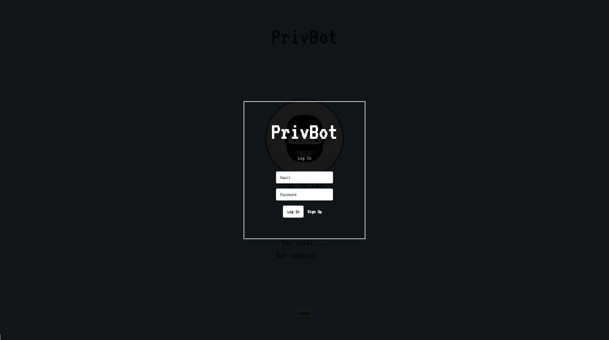
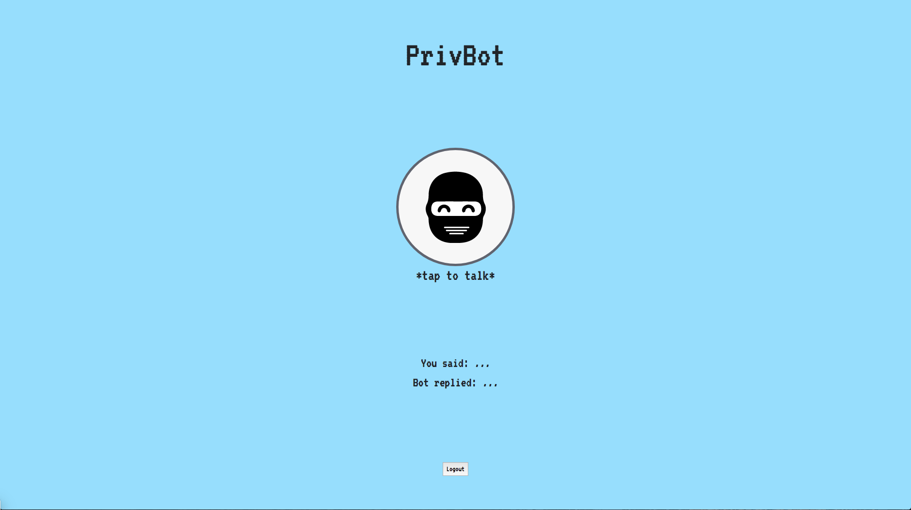

# PrivBot
The concept behind PrivBot is a digital assistant with a focus on security. Users will have their own login to secure their accounts, any data that is stored would be on a private server to avoid data harvisting for profit. As AI // DA tech becomes more integrated with our lives I believe there should be a parallel mindset along with machine learning that will keep user information secure, thus creating a more "human" AI as it enables the ability to keep secrets.

## Screenshots
---

## Technologies Used
---
* [React](https://reactjs.org/)
* [Node.js](https://nodejs.org/en/)
* [Express](http://expressjs.com/)
* [Socket.io](https://socket.io/)
* [JSON Web Tokens](https://jwt.io/)
* [Dialogflow](https://dialogflow.com/)
* [Mlab](https://mlab.com/welcome/)

## Getting Started
---
PrivBot is deployed on [Heroku](https://www.heroku.com/). If you would like to test it out, please download the newest version of Chrome and head over to [PrivBot](https://privbot.herokuapp.com/)

Please refer to my [Trello link](https://trello.com/b/1DdImCTk/privbot) for user stories and wireframes.

## Unsolved Problems
---
* Due to the technology used app wont work on mobile // will only work on the newest version of Chrome.

## Future Enhancements
---

* Port to mobile / cross-browser compatability.

* Develop custom webhooks to expand functionality.
